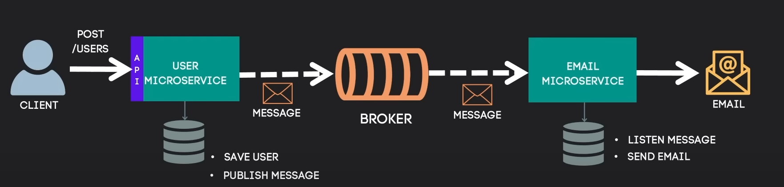

# Microserviço User-Email

Projeto desenvolvido para facilitar a comunicação entre dois microserviços: o serviço de [Usuários](user) e o
de [Email](email). A integração entre eles ocorre de forma assíncrona, utilizando a tecnologia de mensageria RabbitMQ.

## Fluxo Completo da Comunicação Assíncrona

## Tecnologias utilizada

**Linguagem:** Java

**Gerenciador:** Maven

**Framework:** Spring Boot (Web, Data JPA, Validation, AMQP, Mail)

**Banco de Dados:** H2

**Mensageria:** RabbitMQ

**Servidor de Mensageria:** Cloud AMQP

**SMTP:** Gmail